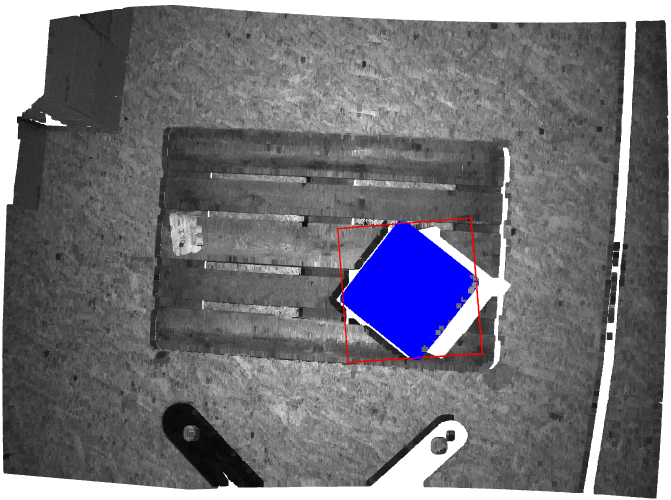
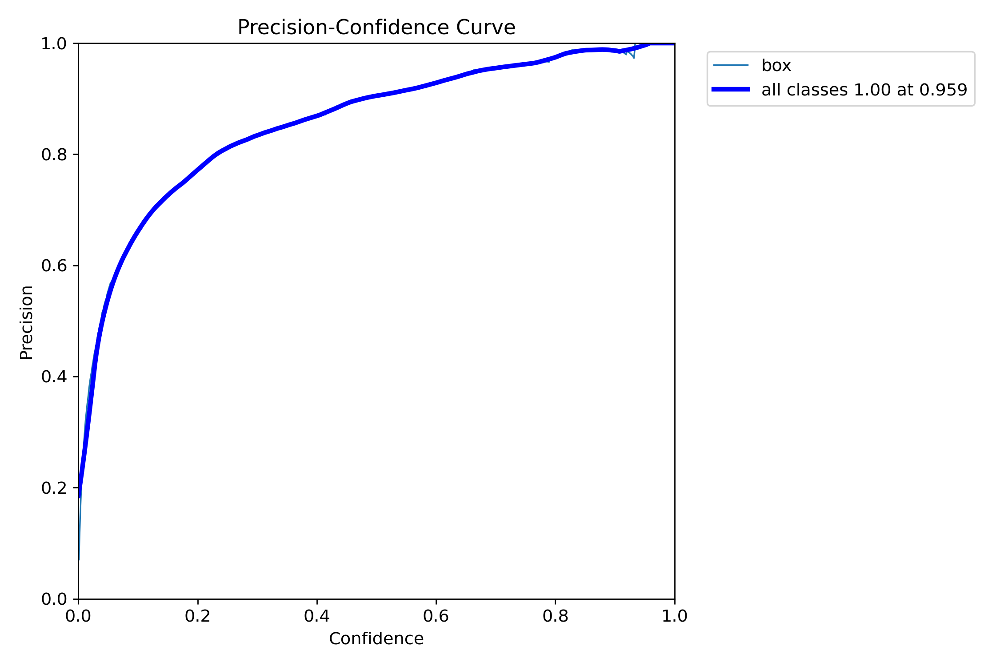
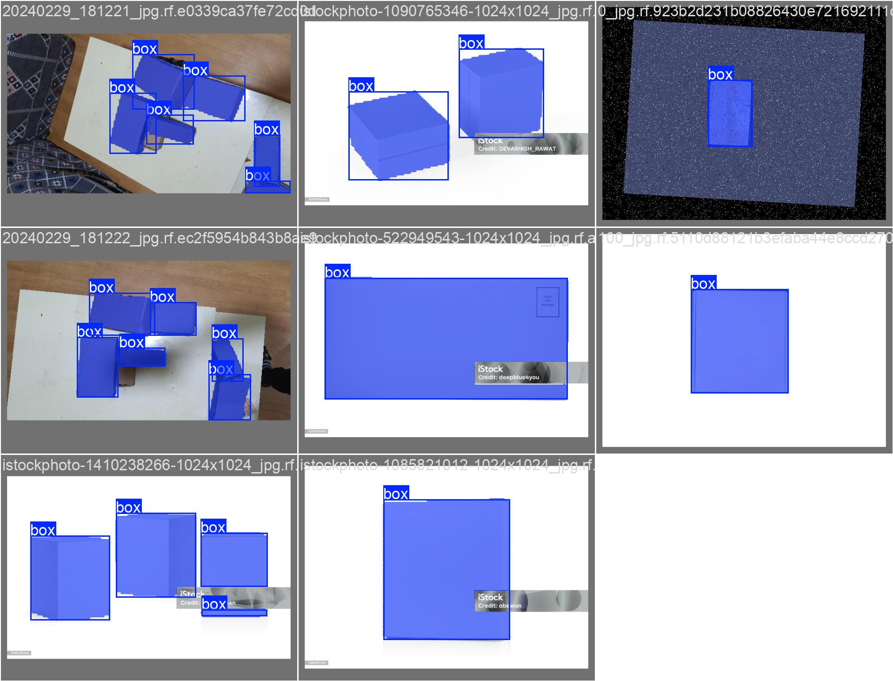
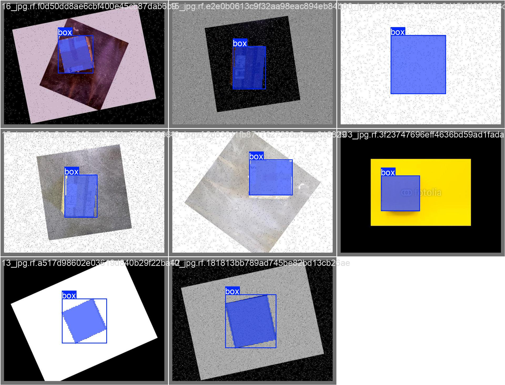

# Robotics Perception Take-Home Task 

This Document contains both the tasks which is Depth Map Processing for Pose Estimation which is implemented inside the folder `PCL` and Trainig the segmentation model which is implemented inside the folder `seg_model`.

## Depth Map Processing for Pose Estimation (TASK 1)

## Overview

This document explains the approach taken to estimate the 3D pose of a known box-shaped object from a provided depth map, as part of the Robotics Perception Take-Home Task. The solution utilizes geometric methods in Python with the Open3D library.

## Run

To view the result just run `pcl.py`
```bash 
cd PCL
python3 pcl.py
``` 

## Approach

The pose estimation process involves the following steps:

1.  **Data Loading:** Loading the provided `.npy` files containing camera intrinsics (`PCL/intrinsics.npy`), depth map (`PCL/one-box.depth.npdata.npy`), and color image (`PCL/one-box.color.npdata.npy`). The `extrinsics.npy` file was not used in this specific pose estimation pipeline.
2.  **Point Cloud Creation:** Generating a 3D point cloud from the depth map using the loaded camera intrinsics. The depth values are scaled by 1/1000 to convert from millimeters to meters.
3.  **Geometric Segmentation:** Isolating the point cloud belonging to the box by:
    * **Plane Fitting:** Using the RANSAC algorithm (`o3d.geometry.PointCloud.segment_plane`) to detect the dominant plane in the scene, assumed to be the table surface. The parameters used were `distance_threshold_plane=0.005`, `ransac_n_plane=3`, and `num_iterations_plane=1000`.
    * **Height Filtering:** Selecting points that are located above the detected table plane by a certain `height_above_plane_threshold=0.0003` meters.
4.  **Outlier Removal (Bonus):** Applying statistical outlier removal (`o3d.geometry.PointCloud.remove_statistical_outlier`) to the segmented point cloud to eliminate noise. The parameters used were `nb_neighbors=70` and `std_ratio=0.3`.
5.  **Pose Estimation:** Estimating the 3D pose (translation and orientation) of the box by fitting an oriented bounding box (`o3d.geometry.PointCloud.get_oriented_bounding_box()`) to the cleaned, segmented point cloud.
6.  **Pose Matrix Output:** Calculating the 4x4 transformation matrix that represents the estimated pose of the box in the camera's coordinate frame. This matrix transforms points from the camera's coordinate system to the object's (bounding box's) coordinate system.
7.  **Visualization:** Displaying the original 3D point cloud of the scene, the segmented and cleaned point cloud of the box (colored blue), and the fitted oriented bounding box (colored red) overlaid on the scene using Open3D's visualization capabilities.

## Assumptions

The following assumptions were made during the development of this solution:

* The dominant flat surface detected by RANSAC corresponds to the table on which the box is placed.
* The box is located at a height greater than 0.0003 meters above the detected table plane.
* The depth values in `one-box.depth.npdata.npy` are in millimeters.
* The camera intrinsics provided in `PCL/intrinsics.npy` are accurate for the captured data.

## Results

The estimated pose of the box is represented by the following 4x4 transformation matrix (Camera to Object frame):

[[-9.88313149e-01  1.00307262e-01  1.14784899e-01 -6.67214024e-04]
[ 1.01156653e-01  9.94869249e-01  1.58417859e-03  1.38413532e-04]
[ 1.14037062e-01 -1.31769208e-02  9.93389107e-01 -2.27246413e-03]
[ 0.00000000e+00  0.00000000e+00  0.00000000e+00  1.00000000e+00]]

This matrix describes the rotation and translation required to transform a point from the camera's 3D coordinate system to the estimated 3D coordinate system of the box (as defined by the oriented bounding box).

The visualization shows the original scene's point cloud, with the segmented and cleaned box point cloud highlighted in blue, and a red oriented bounding box encompassing the estimated pose of the box.

## Visualization

The result is visualized using Open3D, displaying:

* The complete original point cloud of the scene.
* The segmented and cleaned point cloud representing the box, colored in blue.
* A red oriented 3D bounding box fitted to the cleaned box point cloud, visually indicating the estimated 3D pose (position and orientation) within the original scene context.



## Parameters Used

The following key parameters were used in the solution:

* `distance_threshold_plane`: 0.005 (meters)
* `height_above_plane_threshold`: 0.0003 (meters)
* `nb_neighbors`: 70
* `std_ratio`: 0.3

#

# Train segmentation model (TASK 2)

## Objective

Train a segmentation model to detect box-shaped objects in RGB images.

## Environment Setup

It is recommended to train the model within a dedicated Python virtual environment.

**Installation:**

Install the Ultralytics library, which provides the YOLO framework:

```bash 
pip install ultralytics
``` 
[Used YOLO11 segmentation model](https://docs.ultralytics.com/tasks/segment/)

## Model:

This task utilizes the YOLOv11 segmentation model as implemented in the Ultralytics library. For detailed information, refer to the YOLOv11 Segmentation documentation.

## Dataset Preperation

The model was trained on the following publicly available dataset:

[datasetlink](https://universe.roboflow.com/naiworkspace-ljeab/boxes-segmentation-wgjsj/browse?queryText=&pageSize=200&startingIndex=0&browseQuery=true)


## Training Configuration

Training parameters and class definitions are managed in the `yolo_training_param.yaml` configuration file. Key training hyperparameters such as epochs, batch size, the specific YOLOv8 model variant, and image size are defined in the `params.yaml` file.

## Training Procedure

To initiate the training process, execute the following command:

```bash 
cd seg_model/yolo_training_preparation/scripts
python3 yolo_training.py
``` 

## Predict

To perform inference on images using the trained model, run the following script:

```bash 
python3 script/predict_result.py
``` 

## Result 

The following plots illustrate the training performance and loss function:


The precision-confidence curve is shown below:


## Training Logs and Parameters
Detailed training logs, including learning rate schedules and the total number of epochs, can be found in the `result.csv` file generated during the training process.

## Validation result

The following images show visualizations of the model's predictions on the validation set, with the predicted masks overlaid on the original images:





